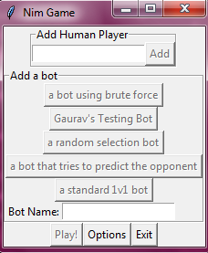
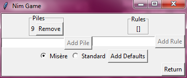

# NimGame

## Table of Contents

* [Intro](#Intro)
* [How to Use](#howtouse)
* [Documentation](#Documentation)
	* [Main](#main)
	* [NimInstance](#NimInstance)
	* [PlayerController](#PlayerController)
	* [NimBots](#NimBots)
	* [NimGUI](#NimGUI)
	* [WinConditions](#WinConditions)
* [Pseudocode](#Pseudocode)
	* [shortPredictionBot](#shortPredictionBot)
	* [bruteForceBot](#bruteForceBot)
	* [gauravTestingBot](#gauravTestingBot)

---

# Intro
Project for CPSC-482 which contains a playable version of the Nim game with customizable rules and bots of varying difficulty to play against.

---

# How to Use <a name="howtouse"></a>

Run `main.py` from the terminal or cmd. This will create a gui.



To add Human Players to the game, one must enter a name first in the `Add Human Player` section. Then press the `Add` button. If done correctly, the name of the new player should show up on the right side of the application.

Similarly to add bots, enter a name in the `Bot Name` entry, and select the button that corresponds to the desired bot. Again, the bot's name will appear on the right, appended with the word 'bot'.

The `Play!` button will remain disabled until at least one player has been added to the player list. If all players are removed from a non-empty player list, the button will disable until at least one player is added again.

Pressing the `Play!` button will result in a new game of Nim beginnning, with the players in the player list, and the currently selected settings.

To change the settings, click on the `settings` button. This will bring up the `settings` menu:



The entry to the left of the `Add Pile` button will only accept digits as an entry. Entering some number into this entry and then pressing the `Add Pile` button will add a pile with the entry's number of objects to the game settings.

The entry on the right will accept any input, but pressing the `Add Rule` button will only have effect if the entry is a non-zero length list of digits. Individual digits can be separated by any character. Once a rule is added, a game of Nim will terminate if the game state is identical to one of that rule, or any other rule in the rule list.

The `Radio Button` below allows one to change the settings from Misere play to Standard play. However, not all of the bots have strategies for Normal play.

The `Add Defaults` button will add the default rules given in the class assignment description if they are not already in the rule list. 

These rules are:

* [2, 2, 2]
* [1, 2, 3]
* [1, 1, 2, 2]

The `Return` button will bring you back to the Main Menu.

Once a game of Nim has been started with the `Play!` button, the GUI will take turns waiting for the `PlayerController`s to supply it with their next move.

Bots will generate moves automatically and inform the user of their move with a message screen. Simply press the `Ok` button to advance to the next turn. 

Human players will be prompted with a move selection screen:


The `RadioButton` is used to select which pile to take from. Select the pile you wish to take from and then enter the amount into the entry below. This entry will only accept digits between 1 (inclusive) and the size of the currently selected pile. Once you have entered the amount and pressed the `Take` button, the GUI will inform the `NimInstance` of your move and proceed.

Winning a game will display a victory screen with a single button. Pressing the button will return you to the Main Menu, where you can decide to play again, change the players or rules, or exit the application.

---

# Documentation

## main

Simple entry point for program. Runs a GUI.

## NimInstance

A class used to store and manipulate information on an instance of a game of Nim, such as the piles and the objects that are currently in said piles.

Stores win conditions as a list of lists. This allows any various win states to be added and checked against when playing.

## PlayerController

An 'abstract' class which is used as a controller for players in a game of Nim. Is used as a super class for bots. Takes a callback method which can be used to determine what happens when it is this controller's turn to play.

## NimBots

Contains various classes that inherit the `PlayerController` class. These classes are designed to programmatically generate decisions on what move to make in a game of Nim, based on the current state of the piles. Any new class added to this file is automatically constructed as a bot option in the GUI.

## NimGUI

Contains the logic and controllers for the GUI. Also controls the order and flow of a Nim game, stores settings for a Nim game to be created, and contains a 'bot factory', for automatically creating instances of bot classes found in `NimBots.py`.

## WinConditions

Contains 'constants' for the default win conditions that will be used in class for convenience.

---

# Pseudocode

## shortPredictionBot

```
using a list of object amounts

if (number of piles with objects > 1) == 1
{
    if (number of piles with objects == 1) is odd
    {
        try removing the large pile
        
        if it results in a loss undo and continue

        otherwise submit move
    }
    otherwise,
    {           
        try taking all but one from large pile

        if it results in a loss undo and continue

        otherwise submit move
    }
}

for all possible moves that create a pile with a nim sum of zero
{
    -try the move
    -then predict all of the oppoenents possible 
     moves

    if a move exists where there is no winning
    move afterwards:
        undo the move and continue

    otherwise submit move 
}

Try all possible moves (that don't lose):

    If one exists that puts the opponent in a 
    losing position:
        Submit the move
    
    Otherwise:
        Submit the move that leaves the largest
        pile

Only losing moves are left: play the first move

```

## bruteForceBot

```
using a list of object amounts

Method for finding a winning move:
{
    if list is in a win state
    {
        if your turn: return 'winning'
        else: return 'losing'
    }


    For all possible moves:
    {
        recurse with not your turn

        if the recursion returns 'winning': 
            return 'winning'
        
        Otherwise: continue
    }

    return 'losing'
}

Method for choosing a move:
{
    Try to find a winning move:
    {
        if found: play it

        Otherwise: continue 
    }

    For all possible moves:
    {
        try the move:
        {
            if it immediately loses: continue

            Otherwise: play it
        }
    }
}

```

## gauravTestingBot
	1. Bot reads the input to analyze the current situation
	2. Then chooses a pile 
	(not sure what should be the criteria to choose one {first pile, second pile…} {pile with most obj} etc.)
	
	For a standard game with only the first win condition:
		X = 0
		for each pile in list:
			X = X xor pile
			
		for each pile in list:
			if pile < X xor pile:
				Choose this pile
				break
		
		If it didn't find a pile, then it's losing.
	
	
	3. After the pile n is chosen, take one object from it;   object count = 1 
	4. Call check_function()        {returns TRUE or FALSE}
		○ 4th condition
		○ 3 piles each with 2 objects, and all other piles are empty.
		○ 1 pile with 1 object, 1 pile with 2 objects, 1 pile with 3 objects, all other piles are empty.
		○ all piles are empty. We need this check because there may be condition n=3 
		
	5. If check() == TRUE:
		○ Increase the object count by 1 
		○ Call check function (step 4)
		○ Recursion this check function == false at object count = i
		○ Return count = i-1
	6. If check() == False:
		○ Choose next pile based on criteria
		○ Repeat from step 3
		
	7. Check if new situation == old situation:
		○ True: You lost
		○ False: send to next bot.
   
   Link to image of [pseudocode](https://user-images.githubusercontent.com/32801600/112295613-4dc61980-8c51-11eb-8720-5645388e8539.png)

---

# Complexity Analysis

